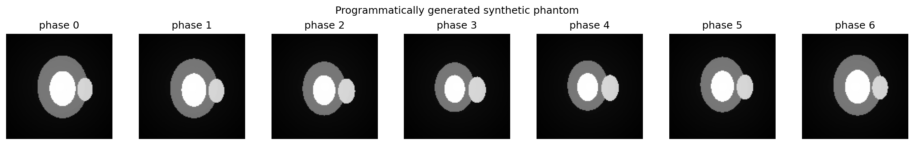

# DragNet

**DragNet** is a probabilistic deep-learning framework for spatio-temporal deformable registration of cine cardiac MR sequences and for motion-sequence generation from one or two reference frames.

This repository is a **2026 public implementation refresh** of the code accompanying:

> A. Zakeri, A. Hokmabadi, N. Bi, I. Wijesinghe, M. G. Nix, S. E. Petersen, A. F. Frangi, Z. A. Taylor, A. Gooya.  
> *DragNet: Learning-based deformable registration for realistic cardiac MR sequence generation from a single frame.*  
> Medical Image Analysis 83 (2023) 102678.  
> https://doi.org/10.1016/j.media.2022.102678

The core network layout and published loss weights are preserved. The surrounding research software has been rewritten to remove restricted data, make I/O explicit and safer, fix engineering bugs in the historical scripts, and provide tests, packaging and CI.



> **Data-safety statement:** this repository contains **no UK Biobank participant data, no UK Biobank images, no trained model weights, and no figures/screenshots derived from UK Biobank data**. All bundled examples are programmatically generated phantoms.

## What DragNet models

DragNet combines a variational latent-variable model, convolutional recurrent state, a probabilistic displacement-field model and a spatial transformer. At each time point it uses the current image and recurrent history to infer a latent state, combines that state with features from the moving image to infer a displacement distribution, warps the moving frame, and then updates the recurrent state.

```mermaid
flowchart LR
    H[Previous recurrent state h] --> P[Prior p(z | h)]
    I[Current frame] --> X[Image features]
    X --> Q[Posterior q(z | I,h)]
    H --> Q
    Q --> Z[Sample z]
    Z --> ZF[Latent features]
    M[Moving frame] --> MF[Moving-image features]
    ZF --> D[Posterior q(D | moving,z)]
    MF --> D
    D --> S[Sample displacement D]
    M --> STN[Spatial transformer]
    S --> STN
    STN --> O[Registered / generated frame]
    ZF --> R[ConvLSTM]
    X --> R
    R --> H2[Updated recurrent state]
```

The published 128 × 128 architecture is kept intentionally rather than silently generalising the fully connected layers to different spatial sizes.

## Main capabilities

- paper-faithful DragNet network modules for 128 × 128 cine sequences
- probabilistic latent-state inference and recurrent prior
- pixel-wise displacement mean/covariance modelling
- differentiable 2D spatial transformation
- registration over complete cyclic sequences
- generation from one frame or from two frames
- RMSE and Jacobian-determinant utilities
- safe NumPy `.npz` / `.npy` input instead of pickle
- deterministic train/validation splitting
- numbered checkpoints with explicit one-based epoch numbering
- fully synthetic phantom generator for public testing
- command-line interface and Python API
- tests and GitHub Actions across Python 3.10–3.13

## Important scope

This repository is research software. It does **not** provide a clinically validated tool, diagnostic output, normative ranges, or a pretrained model. Reproducing the numerical results in the paper requires appropriately authorised source data and the experimental setup described in the publication.

The original study used UK Biobank 4-chamber long-axis cine CMR. Those data are not redistributed here. See [Data and weights](docs/data-and-weights.md).

## Installation

Create a clean Python environment, clone the repository, and install in editable mode:

```bash
git clone https://github.com/alireza-hokmabadi/DragNet.git
cd DragNet
python -m pip install -e .
```

For development:

```bash
python -m pip install -e ".[dev]"
```

The runtime dependencies are PyTorch, NumPy, SciPy and Matplotlib.

## Quick public-safe smoke test

Generate a synthetic moving-ellipse phantom dataset:

```bash
dragnet-cmr synthetic synthetic_demo.npz --samples 8
```

This also writes a PNG preview next to the NPZ file. The phantom is generated entirely from analytic shapes and is not derived from medical imaging data.

Run the architecture with untrained weights:

```bash
dragnet-cmr smoke --device cpu
```

The smoke test verifies tensor flow through the complete architecture. It is **not** a registration-quality or generation-quality demonstration.

## Input format

Training, registration and generation accept NumPy files only:

```text
.npz key: sequences
shape: (N, T, 128, 128) or (N, T, 1, 128, 128)
dtype: uint8 in [0,255] OR floating point already in [0,1]
```

Example:

```python
import numpy as np

# sequences: N x T x 128 x 128
np.savez_compressed("my_authorised_data.npz", sequences=sequences)
```

Python pickle files are deliberately rejected because unpickling untrusted files can execute arbitrary code.

## Phase A — training

```bash
dragnet-cmr train my_authorised_data.npz \
  --output-dir checkpoints \
  --epochs 70 \
  --batch-size 10 \
  --learning-rate 0.001 \
  --sigma-blur 0.2 \
  --device auto
```

Checkpoints are written as:

```text
checkpoints/
├── dragnet_epoch_001.pt
├── ...
├── dragnet_epoch_070.pt
└── dragnet_final.pt
```

This fixes the historical off-by-one mismatch where a 70-epoch run produced an epoch-69 filename while the test script expected epoch 70.

For a dataset of 4,620 sequences, the paper used 4,000 training subjects and 620 evaluation subjects. To request a fixed validation count rather than a fraction:

```bash
dragnet-cmr train my_authorised_data.npz --validation-count 620
```

No UK Biobank dataset is included or implied by this command.

## Phase B — registration

With your own authorised data and a checkpoint trained by you:

```bash
dragnet-cmr register my_authorised_data.npz checkpoints/dragnet_final.pt \
  --index 0 \
  --output outputs/registration.npz \
  --figure outputs/registration.png
```

The NPZ output contains:

- `registered`: registered sequence, shape `(T, 128, 128)`
- `displacement`: displacement fields, shape `(T, 2, 128, 128)`

## Phase C — sequence generation

Generate from one reference frame:

```bash
dragnet-cmr generate my_authorised_data.npz checkpoints/dragnet_final.pt \
  --mode one \
  --frames 7 \
  --output outputs/generated_one_frame.npz
```

Or condition the first transition on the first two frames:

```bash
dragnet-cmr generate my_authorised_data.npz checkpoints/dragnet_final.pt \
  --mode two \
  --frames 7 \
  --output outputs/generated_two_frames.npz
```

## Python API

```python
import torch

from dragnet_cmr import DragNet

model = DragNet(displacement_sampling="legacy")
sequence = torch.rand(1, 7, 1, 128, 128)

output = model(sequence)
print(output.registered.shape)     # (1, 7, 1, 128, 128)
print(output.displacement.shape)   # (1, 7, 2, 128, 128)
print(output.losses.total)
```

## Reproducibility versus corrected experimentation

Two historical behaviours are made explicit instead of being silently changed.

### Displacement sampling

The historical implementation sampled displacement using `0.5 * covariance @ epsilon`. A mathematically conventional multivariate-Gaussian sampler uses a matrix square root such as a Cholesky factor. Because changing this would alter the implementation used for the published work, the public refresh defaults to:

```text
--sampling legacy
```

For new experiments you can explicitly choose:

```text
--sampling cholesky
```

The `cholesky` option is provided as an engineering/scientific correction for future investigation; it is **not claimed to reproduce the paper's reported results**.

### Gaussian preprocessing

The historical code passed a scalar sigma to `scipy.ndimage.gaussian_filter`, which applies the small blur across temporal and spatial axes. That behaviour is retained as `--blur-mode legacy` for reproducibility. A spatial-only alternative is available as `--blur-mode spatial`.

More details are in [Implementation notes](docs/implementation-notes.md) and [Legacy fidelity verification](docs/fidelity-verification.md).

## Testing

```bash
python -m pytest
```

With development dependencies:

```bash
python -m ruff check .
python -m mypy src/dragnet_cmr
python -m pytest --cov=dragnet_cmr --cov-report=term-missing --cov-fail-under=80
python -m build
```

## Repository data policy

Do not commit:

- participant images or segmentations
- UK Biobank-derived images, screenshots or examples
- trained checkpoints derived from restricted datasets
- subject identifiers or data manifests
- local institutional data paths

The `.gitignore` blocks common model-weight and output extensions by default. See [Data and weights](docs/data-and-weights.md).

## Citation

If you use the DragNet method, please cite:

```bibtex
@article{zakeri2023dragnet,
  title   = {DragNet: Learning-based deformable registration for realistic cardiac MR sequence generation from a single frame},
  author  = {Zakeri, Arezoo and Hokmabadi, Alireza and Bi, Ning and Wijesinghe, Isuru and Nix, Michael G. and Petersen, Steffen E. and Frangi, Alejandro F. and Taylor, Zeike A. and Gooya, Ali},
  journal = {Medical Image Analysis},
  volume  = {83},
  pages   = {102678},
  year    = {2023},
  doi     = {10.1016/j.media.2022.102678}
}
```

## Software licensing

This repository is intentionally published **without an open-source software licence**. The DragNet paper states that the code would be made publicly available, but the original implementation was collaborative University of Leeds research software and the paper credits both Arezoo Zakeri and Alireza Hokmabadi with software contributions. Public availability therefore should not be treated as an MIT/BSD/Apache/GPL-style permission grant.

See [LICENSING.md](LICENSING.md) for the licensing status and the distinction between the article's CC BY 4.0 licence and the software.

## Acknowledgement

This implementation accompanies collaborative academic work by the authors of the DragNet paper. Please refer to the publication for the full scientific method, evaluation protocol, limitations and authorship.
